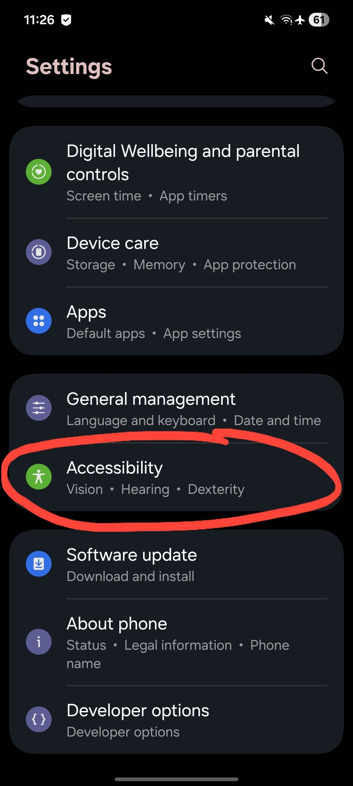
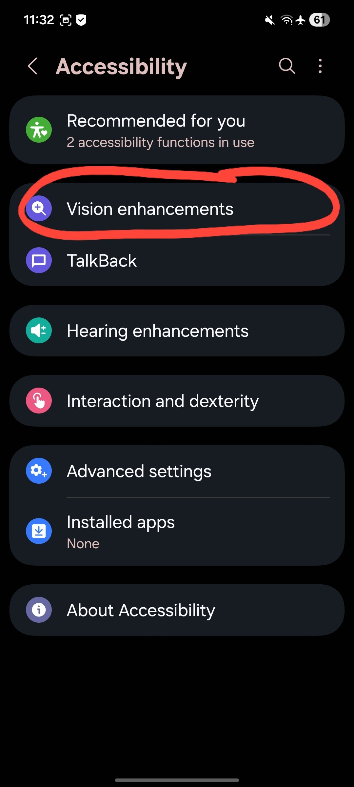
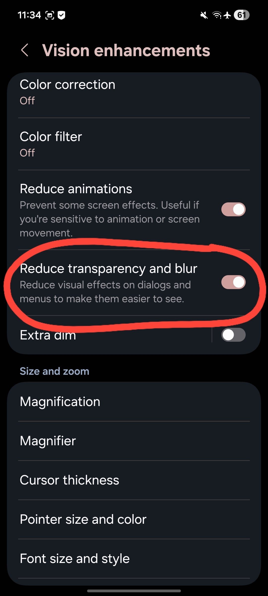
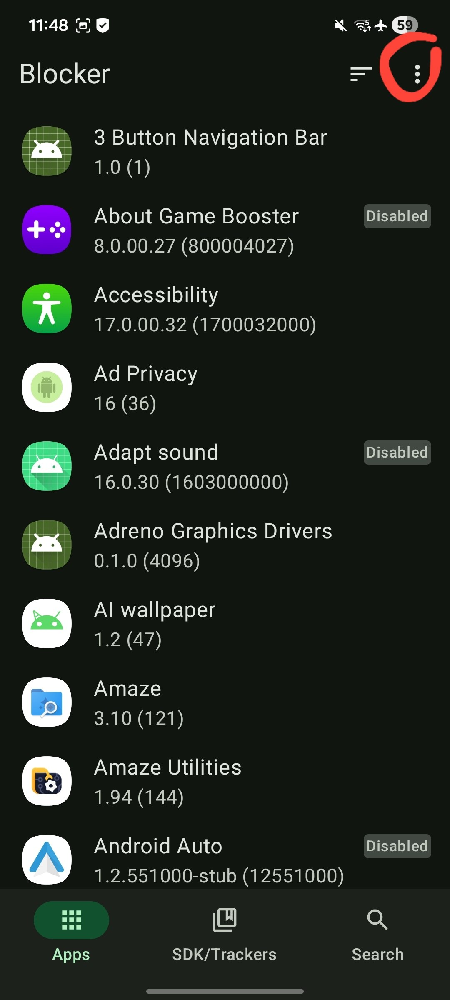
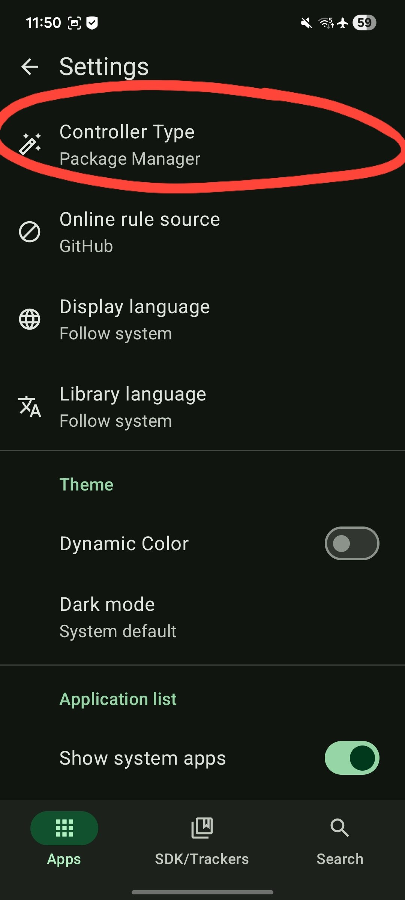
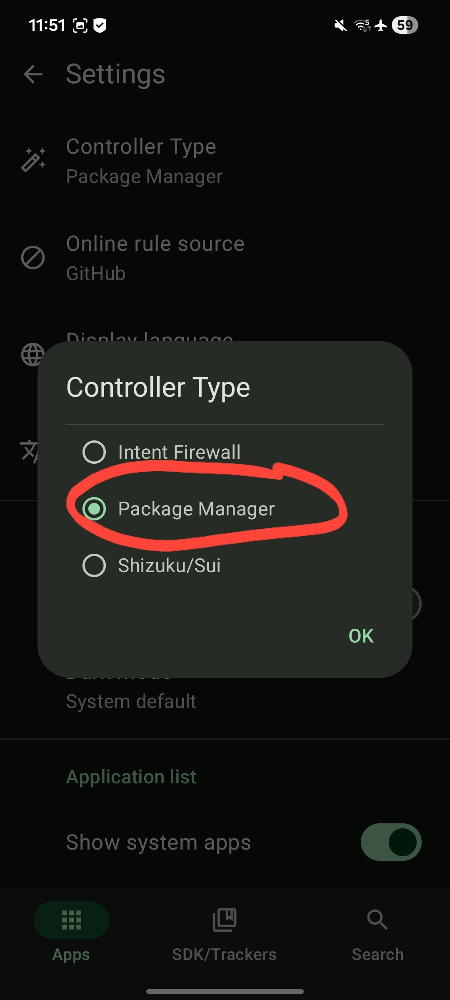
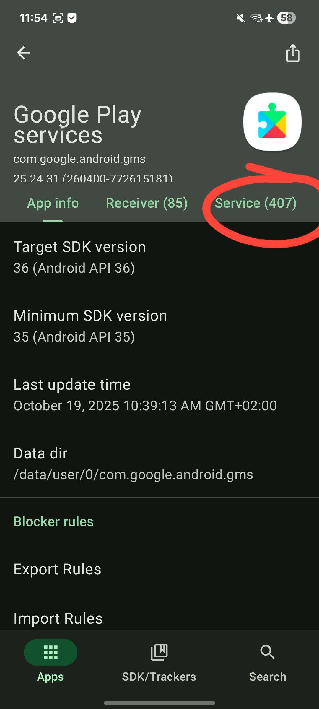
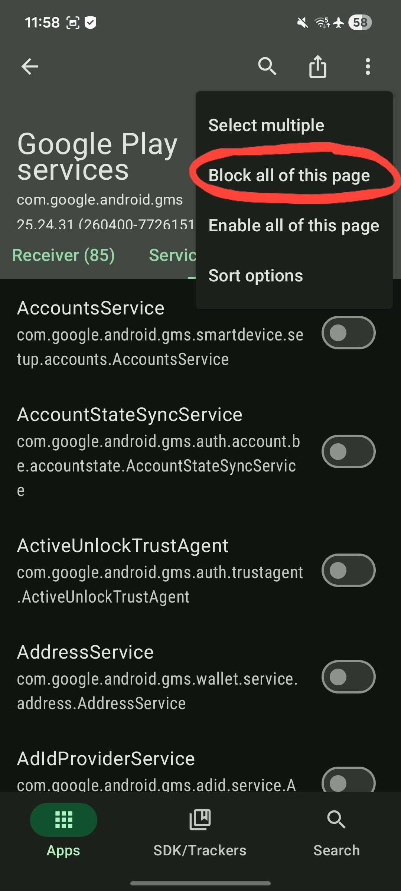
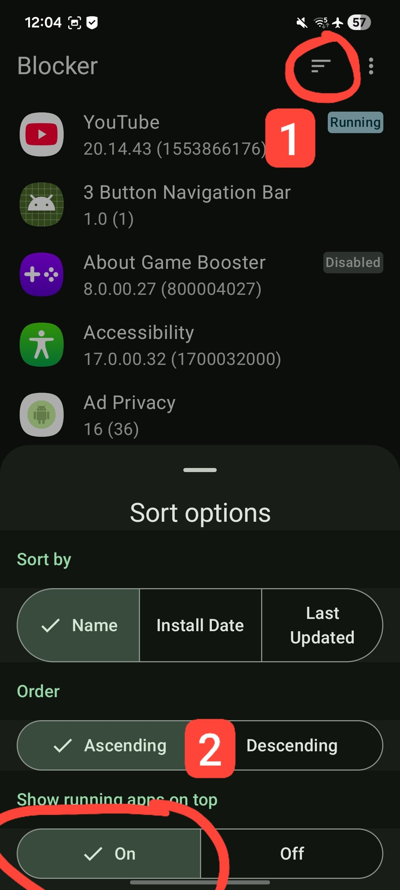
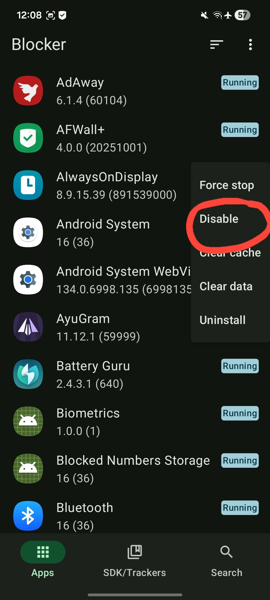

# Mastering UN1CA for Dummies
A guide on how to fix certain issues on our beloved ROM called [UN1CA](https://github.com/salvogiangri/UN1CA)

So you've just installed [UN1CA](https://github.com/salvogiangri/UN1CA), or you may already be using it, and you have certain questions like "Why is my SoT (Screen on time) so bad?" (I haven't come up with other questions so far. Contact me if you have other questions!) Then this guide is for you!

## Fixing SoT (Screen on time) issues
So let's say you were using [Project NERV](https://github.com/yagzie/NERV) before and your SoT was around, let's say, 7-8 hours, and you were happy with it. Now you've installed [UN1CA](https://github.com/salvogiangri/UN1CA) and your SoT is around ~5 hours, and you think it's a ROM issue. Well, it has nothing to do with the ROM at all! It's just how OneUI is built, and blaming the ROM is just plain wrong. So let's see how we can fix this OneUI properly without any performance loss! 

##### Note: Some tweaks require root to work. It doesn't matter which root solution you use, as long as it works.

### Let's start with the easy stuff!

#### Reducing transparency and blur (Doesn't require root)
1. Open Settings
2. Scroll down and click on "Accessibility"

3. Click on "Vision enhancements"

4. Scroll to the middle and toggle on "Reduce transparency and blur"

#### Using a proper Firewall app to deny internet access to 99% of the system (Root required)
1. [Download](https://github.com/ukanth/afwall/releases) the latest version of AFWall+
2. Open it and give it root permissions
3. Click on the three dots on the top right corner

4. Click on "Enable firewall"

5. Enable internet access for core stuff:
- Google Play Services
- Google Play Store
6. Enable internet only for apps that you need!
7. Save the changes by clicking on the three dots on the top right corner and clicking on "Apply" and wait until it's done

##### Note: This easy step (if you have root) gives the best results of all tweaks shown under the "Fixing SoT" topic!

#### Downloading the Blocker app and fixing Google Play Services eating a ton of battery (root required)

##### Fixing Google Play Services
1. [Download](https://github.com/lihenggui/blocker/releases) the latest Blocker version (foss variant!)
2. Open it (and give root permission if required) and click on the three dots at the top right corner 

3. Go to settings and click on "Controller Type"

4. Choose "Package Manager" and click ok

5. Close and open the app then go to the "Search" tab below and search for "Google Play Services" and click on it

6. Wait until it loads (around 10 seconds) and click on the "Service" tab (Note: the amount of services may differ for each person)

7. Click on the three dots on the top right corner and click on "Block all of this page" and wait until it's done

8. Enable the core services needed for GMS to work (let me know if there should be something else enabled)
   - GetToken
   - GmsApiService
   - GoogleAccountAuthenticatorService
   - MessagingService
   - PushMessagingRegistrarProxy
   - If you have smartwatches, consider enabling WearableSyncMessageService

##### Note: Really useful if you experience very low SoT due to Google Play Services running in the background

##### Making use out of the Blocker app
1. Go to the Blocker app homescreen and click on the sort option and choose "On" for "Show running apps on top"

2. Go back to the homescreen and scroll to the top
3. Look for apps that you don't want to be running at all. Press and hold on the app you want to disable and click on "Disable"

##### Note: Not every app can be disabled!

Great! You've applied the tweaks. Now enjoy using [UN1CA](https://github.com/salvogiangri/UN1CA) like how I do!

Any contribution to this guide is welcome!

For any additional information or questions feel free to ask me on my [Telegram account](https://t.me/victoriafreeman69)
