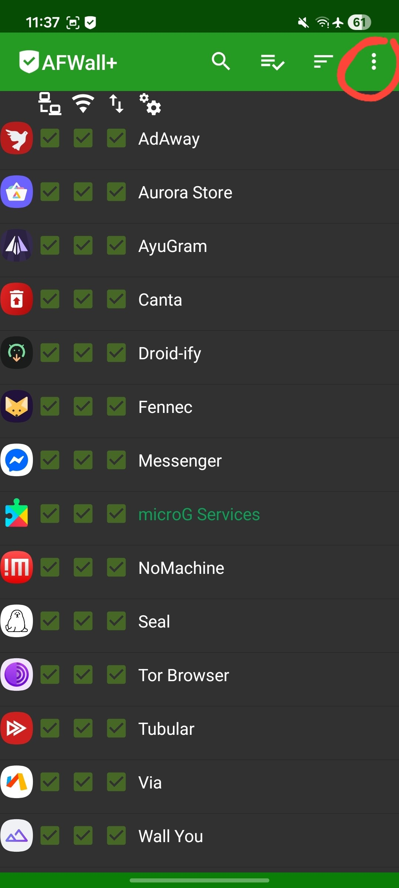
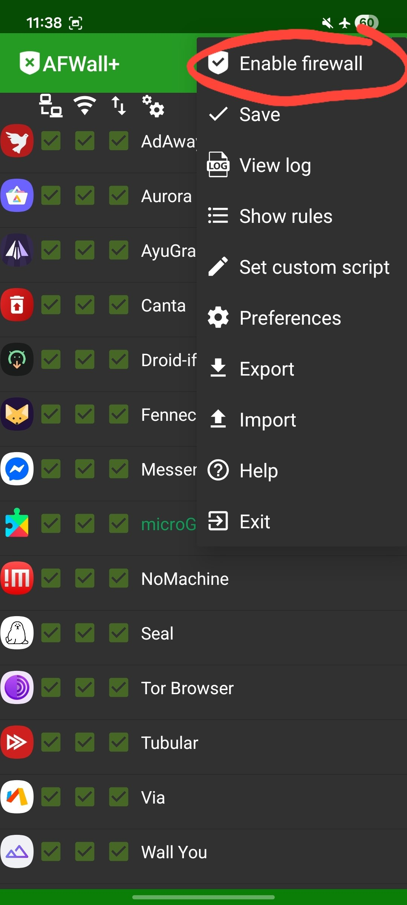
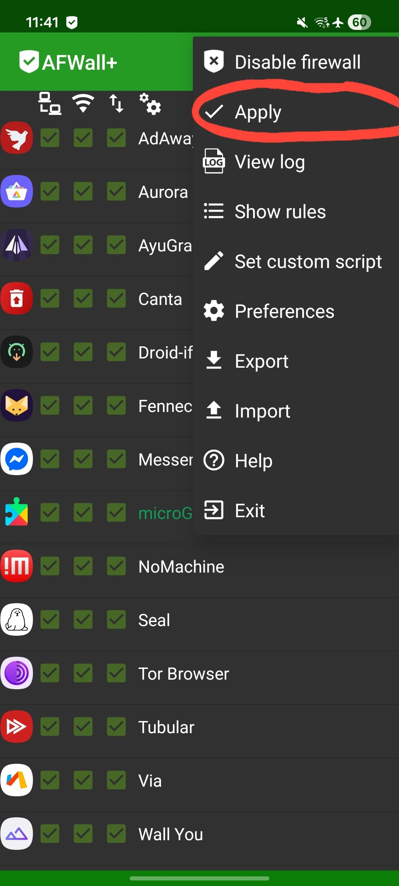

# Connecting to Wi-Fi with help of AFWall+

1. [Download](https://github.com/ukanth/afwall/releases) the latest version of AFWall+
2. Open it and give it root permissions
3. Click on the three dots on the top right corner

4. Click on "Enable firewall"

5. Enable internet access for core stuff:

- Google Play Services
- Google Play Store

6. Enable internet only for apps that you need!
7. Save the changes by clicking on the three dots on the top right corner and clicking on "Apply" and wait until it's done

Now you can safely connect to Wi-Fi and enjoy your device without any issues!