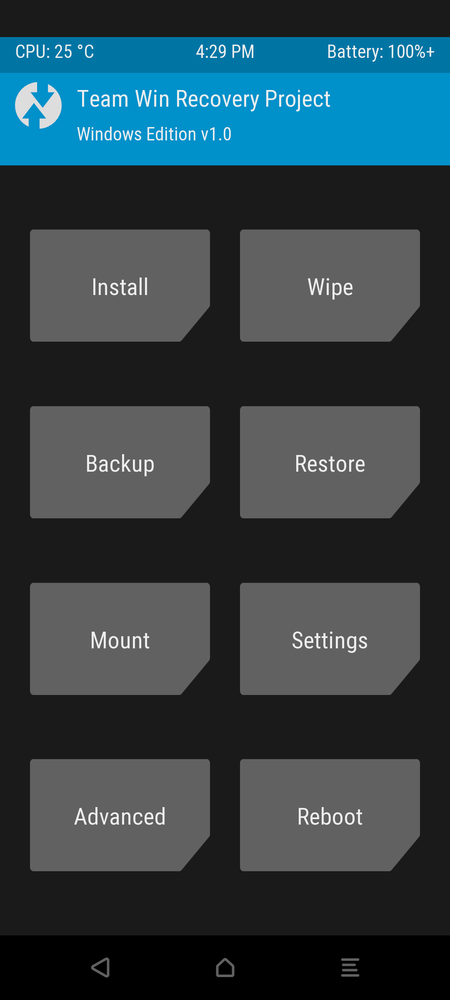
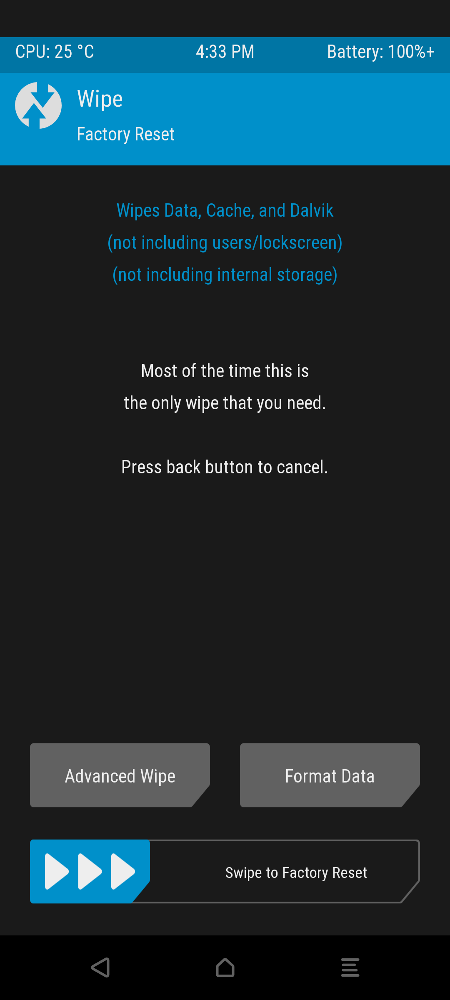
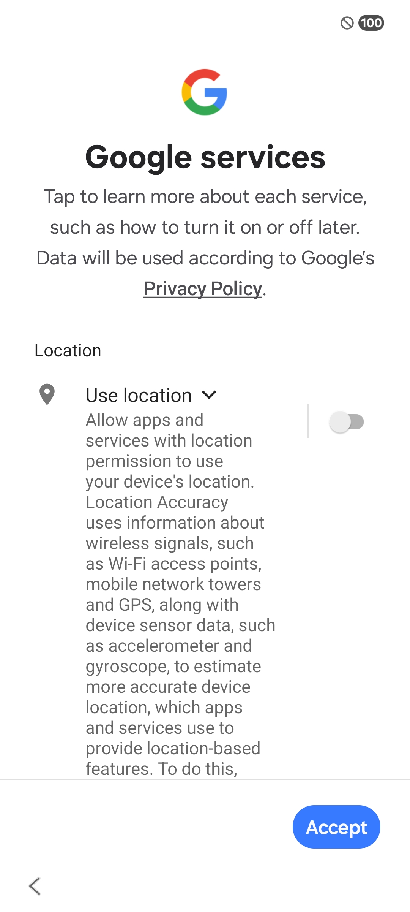
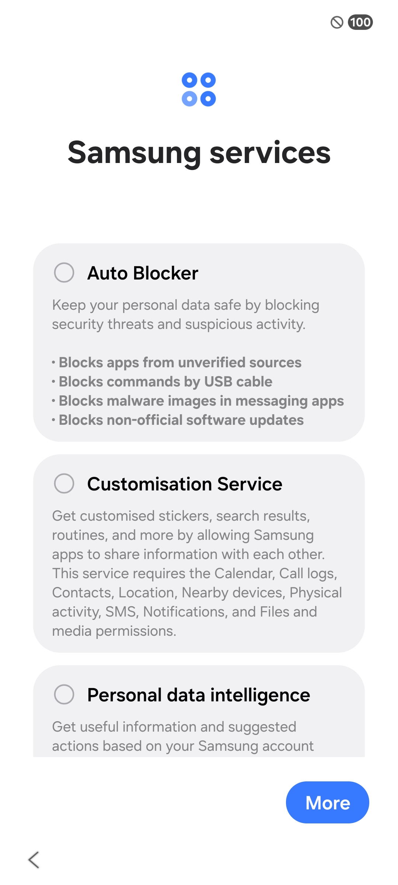
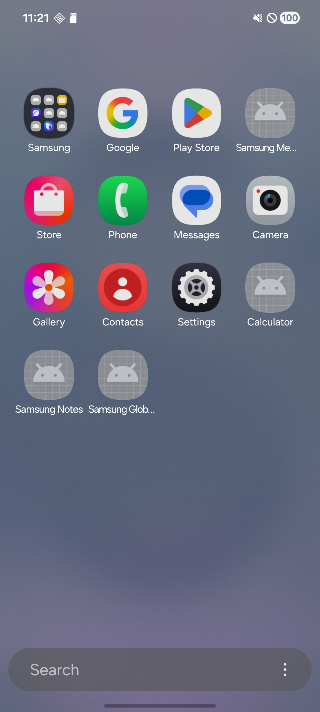
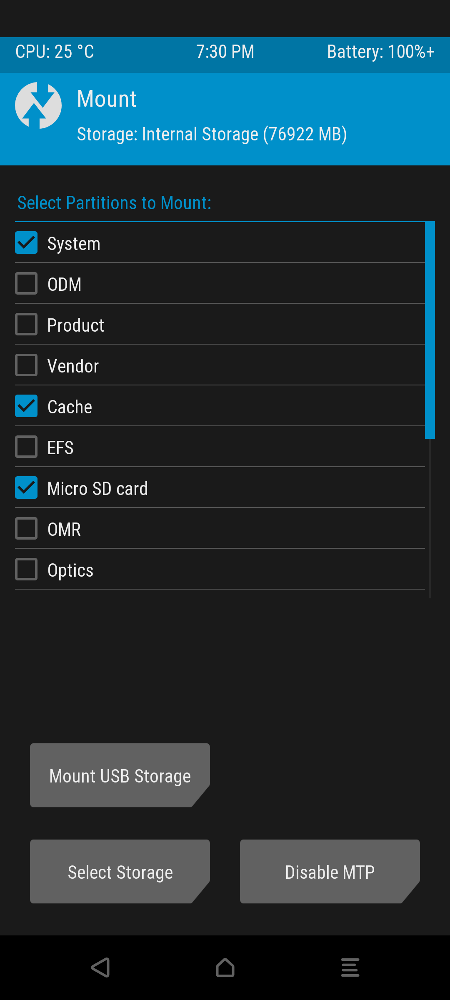

# How to properly install [UN1CA](https://github.com/salvogiangri/UN1CA)

In order to download UN1CA you only need to have your bootloader unlocked and a custom recovery installed.
It may differ for some devices, so check your device's guide on how to unlock the bootloader and install a custom recovery. Believe me, there are already a ton of guides on how to do it. In this guide, I will use TWRP since it's the most commonly used custom recovery.

Once you have your bootloader unlocked and a custom recovery installed, you can download UN1CA-ext4 from [here](https://github.com/Victoria-Freeman/UN1CA-ext4/releases) or if you prefer UN1CA you can download it from [here](https://github.com/salvogiangri/UN1CA/releases).

Now you need to boot into recovery and you will see something like this: \


Click on "Install" and navigate to the UN1CA zip file (usually somewhere inside of `/sdcard`, which is your internal storage) and click on it. Wait until it's done.

Now go back to the TWRP main menu and click on "Wipe". \


Click on "Format Data", type "yes", and press enter. \


**Note: Don't connect to Wi-Fi! Under any circumstances!** We will connect to Wi-Fi in the next guide.

**Remove the SIM card from your device since it would auto-connect to the internet in the setup wizard!**

After it's done, click on "Reboot System" and you should have UN1CA installed!


So now you're on the setup wizard. Congrats! Though there are still things left to do to properly master UN1CA installation.

When you are at the "Google services" section, please toggle off all the toggles there! \


Same goes to the "Samsung services" section! \
 \
**Note:** "Personal data intelligence" is primarily used for AI features (e.g., Now Brief). If you need these features or use Galaxy Watch, consider keeping it enabled.

Great! Now you're seeing your home screen and some notifications about "setting up your phone" or something similar. Safely swipe to dismiss them and don't ever worry about them again!

You may also swipe your screen up and see this: \


You may ask why are some apps grayed out? Well, that's because Samsung loves to push useless things over the internet and it drains our battery when connected to Wi-Fi. So why don't we proceed to remove them? 

1. Boot into recovery. 
2. Click on "Mount".
3. Check "System". \

4. Go to the home screen and click on "Advanced" and then "Terminal".
5. Type the following command to make the system writable:
```bash
mount -o remount,rw /system_root
```
6. Type the following command to remove the OMCAgent5 app:
```bash
rm -rf /system_root/system/priv-app/OMCAgent5/
```
7. Reboot into system. 

You may still see that the grayed out apps are still there but don't worry! There is only one step left!

8. Go to Settings > Apps > One UI Home > Storage > Clear data.

Congrats! You've successfully installed UN1CA the right way! 

**Though don't think it's all it takes to master UN1CA.**